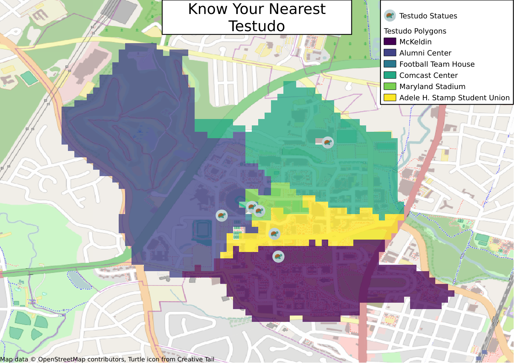
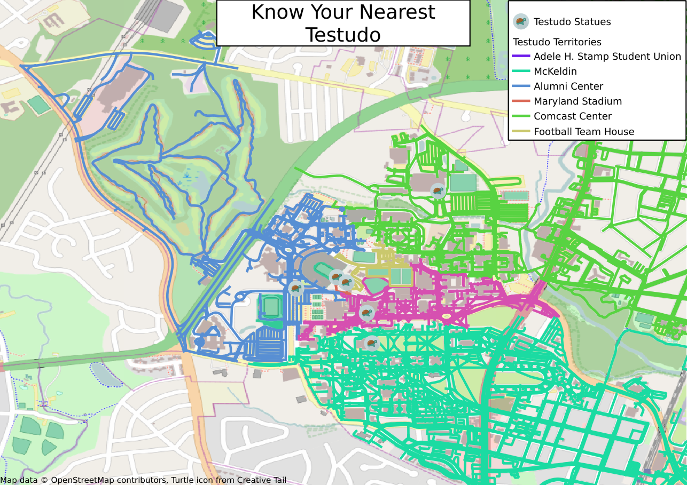

# About the Map
The 'Know Your Nearest Testudo' map shows you which statue of Testudo you are
closest to, regardless of where you are on campus.

The first step in the process is obtaining raw data that can be processed to
obtain the specific information needed. All data for this project is obtained
from [OpenStreetMap](https://www.openstreetmap.org/) using the [OverPass API](http://overpass-api.de/)
and the scripts used to download the data are available in this repository.

Intermediate processing of the data is done using SQL in a Spatialite database.
This removes unnecessary information from the raw data and transforms into a
format that is easier to manipulate in QGIS. At this point Spatialite functions 
are used to generate a Voronoi on the locations of the Testudo statues.

Final processing of the data and rendering of the map is done either using QGIS
locally or the Leaflet JavaScript API in a web browser.

# Rendering the Map
 * Use the included Makefile (`make all`) to download and process the required
   OpenStreetMap data. When the scripts complete, you will have a  Spatialite
   database populated with all the Testudo statues on campus and Voronoi
   polygons for each statue.
 * Open the included QGIS project file using QGIS version at least 3.2. If the 
   first step was completed correctly, it should find the database and display
   the data.
 * Click on the Project menu in the top bar then, Layouts and 'Layout 1'. This
   will open the layout editor window.
 * In the layout editor window, Select Layout in the top bar then
   'Export as Image...' (or any of the other export options).
 * From this point follow the prompts to save the output file.

# Serving the webpage on the UMD Grace cluster
 * Replace every instance of 'kastner' in the files in webpage directory with
   your directory id and update the grace url in the Makefile.
 * As when using QGIS, use the included Makefile to generate data files
   (`make all`).
 * The Makefile also contains the commands requried to upload the files to
   grace (`make publish`).
 * View the webpage at https://terpconnect.umd.edu/~$DIRID/testudo_map.html
